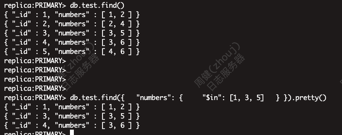

<article-title title="MongoDB使用小祭巧"></article-title>

<article-meta created="2023年8月01日" updated="2023年10月11日"></article-meta>

---

### 基础操作

#### 连接客户端
使用user和pwd登陆客户端,并使用admin认证
```sql
mongo 127.0.0.1:27017 -u user -p pwd --authenticationDatabase admin
```
#### 登陆客户端
登陆
```sql
mongo 127.0.0.1:27017
```
指定admin
```sql
use admin
```
认证
```sql
db.auth("admin":"123456")
```
#### 创建用户
创建用户并指定角色
```sql
db.createUser({user:"admin",pwd:"123456",roles:["root"]})
```

#### 数据库基本操作
查看数据库
```sql
show dbs
```
切换数据库
```sql
use databasesA
```
查询表
```sql
show tables/collections;
```
查询TableA
```sql
db.TableA.find()
```

#### 查询字段是否存在
查询TableA的field_a字段不存在的记录
```sql
db.TableA.find(field_a:{$exists:false}})
```

#### 更新表记录
查询更新TableA中,id=ObjectId("1797501595148103763")这条记录的name和age字段
```sql
db.TableA.updateOne(
    { _id: ObjectId("1797501595148103763") },
    { $set: { name: "hello" ,"age": 18} }
)
```
如果需要更新多条记录,使用updateMany
```sql
db.TableA.updateMany(
    { _id: ObjectId("1797501595148103763") },
    { $set: { name: "hello" ,"age": 18} }
)
```

### 索引操作

#### 创建单个索引
后台为Table_Name的field_a创建一个倒序索引
```sql
db.Table_Name.createIndex({"filed_a":-1},{background:1})
```

#### 创建联合索引
后台为Table_Name的field_a创建一个field_a和created_time的联合倒序索引
```sql
db.Table_Name.createIndex({"filed_a":-1,created_time:-1},{background:1})
```

#### 查看索引
后台为Table_Name的field_a创建一个field_a和created_time的联合倒序索引
```sql
db.Table_Name.getIndexes()
```

### 高级操作

#### 使用Function更新
* 先查询,再遍历更新
```sql
# 给Test表中的name字段增加一个CRM-的前缀,筛选条件是name为空的
db.Test.find({ name: ""}).forEach(function(doc) {
  db.Test.update(
    { _id: doc._id },
    { $set: { name: "CRM-" + doc.name } }
  );
});
```

### 其他操作

#### 数组字段查询使用in查询
我们业务有个字段需要多选,同时数据库字段也是一个数组类型,举例说明一下使用:
* 创建一个测试表
```sql
db.test.insertMany([
   {
     "_id": 1,
     "numbers": [1, 2]
   },
   {
     "_id": 2,
     "numbers": [2, 4]
   },
   {
     "_id": 3,
     "numbers": [3, 5]
   },
   {
     "_id": 4,
     "numbers": [3, 6]
   },
   {
     "_id": 5,
     "numbers": [4, 6]
   }
 ])
```
* 查询语句
```sql
db.test.find({"numbers": {"$in": [1, 3, 5]}}).pretty()
```
* 查询结果

> 还好使用的是MongoDB,如果使用mysql,这个功能要被伤透脑筋.

> 所以MongoDB和MySQL各有优劣,mysql在事务和查询速度层面那肯定顶呱呱,但是在数据结构层面,肯定是不如mongo便捷,毕竟一个弱类型,一个强类型.

#### 数据导出
```sql
mongoexport -h 127.0.0.1 --port 27017 -u user -p pwd --authenticationDatabase=admin -d db_test -c t_test -f "url" -o export.csv --noHeaderLine -q '{"f_id":"64c0bc255a1bca0001fef5bd","status":1}'
```
解释:
-h 127.0.0.1：指定 MongoDB 服务器的主机名或 IP 地址。这里设置为 127.0.0.1 表示连接本地的 MongoDB 服务器。

--port 27017：指定 MongoDB 服务器的端口号。这里设置为 27017，表示使用该端口连接 MongoDB。

-u rwuser -p admin --authenticationDatabase=admin：指定连接 MongoDB 服务器所需的认证信息。-u 是用户名，-p 是密码，--authenticationDatabase 指定认证数据库，这里设置为 admin。

-d db_test：指定要导出的数据库名称，这里是 db_test。

-c t_test：指定要导出的集合（表）名称，这里是 t_test。

-f "url"：指定要导出的字段（列），这里是 url 字段;多个文档使用逗号分割,-f "field1,field2,field3"

-o export.csv：指定输出的 CSV 文件名，这里是 export.csv。

--noHeaderLine：表示导出的 CSV 文件不包含标题行。

-q '{"f_id":"64b7a6a63ff5dd0001a4e8f4","status":1}'：指定查询条件，只导出满足该查询条件的数据。这里查询的条件是 f_id 字段等于 "64b7a6a63ff5dd0001a4e8f4" 并且 status 字段等于 1 的文档。
