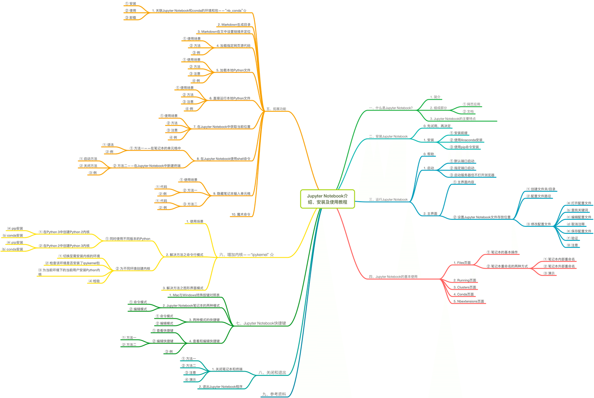

<article-title title="Jupyter安装"></article-title>

<article-meta created="2023年8月15日" updated="2023年8月15日"></article-meta>

---

### 安装
在 MacOS 上安装 Jupyter Notebook 可以通过 Anaconda 进行，这是一个常用的 Python 环境管理工具。以下是安装步骤：

1. **安装 Anaconda:**
   首先，你需要下载并安装 Anaconda。前往 Anaconda 官方网站（https://www.anaconda.com/products/distribution）下载适用于 macOS 的 Anaconda 安装包。选择 Python 3.x 版本的安装包，下载后双击运行安装。

2. **创建虚拟环境:**
   打开终端（Terminal）并运行以下命令，创建一个新的虚拟环境（例如，命名为 `myenv`）：

   ```bash
   conda create -n myenv python=3.8
   ```

3. **激活虚拟环境:**
   在终端中，激活刚刚创建的虚拟环境：

   ```bash
   conda activate myenv
   ```

4. **安装 Jupyter Notebook:**
   在虚拟环境中运行以下命令安装 Jupyter Notebook：

   ```bash
   conda install jupyter
   ```

5. **启动 Jupyter Notebook:**
   在终端中，进入你想要的工作目录，然后运行以下命令启动 Jupyter Notebook 服务器：

   ```bash
   jupyter notebook
   ```

   这将会在浏览器中打开 Jupyter Notebook 的界面，你可以在其中创建和运行 Jupyter 笔记本。

6. **关闭 Jupyter Notebook:**
   在终端中，按下 `Ctrl + C` 组合键来停止 Jupyter Notebook 服务器的运行。

记得，在每次需要使用 Jupyter Notebook 时，你都需要激活虚拟环境。可以使用以下命令来激活虚拟环境：

```bash
conda activate myenv
```

然后你可以在虚拟环境中运行 Jupyter Notebook。

### 总览
 

### 参考文档
* [Jupyter Notebook介绍、安装及使用教程](https://zhuanlan.zhihu.com/p/33105153)
* [在线体验](https://jupyter.org/try-jupyter/lab/)
* [官方文档](https://jupyter-server.readthedocs.io/en/latest/users/index.html)